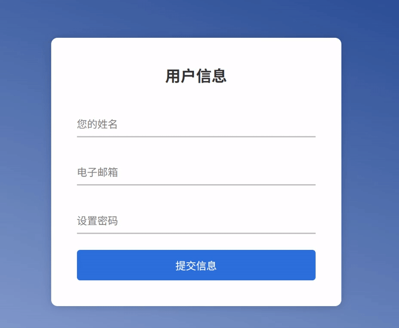
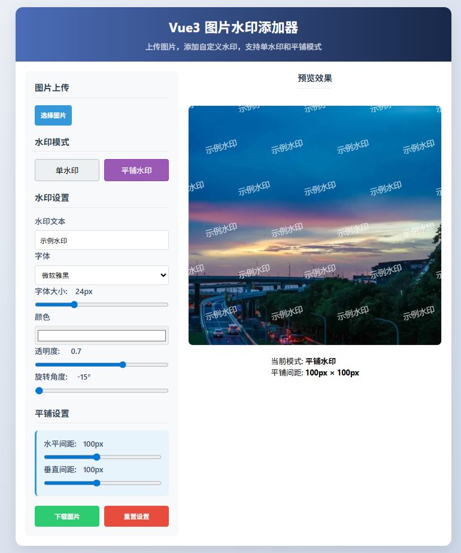
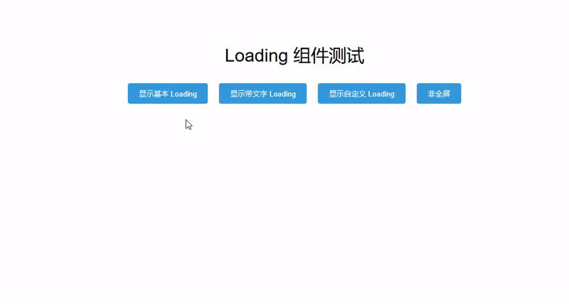
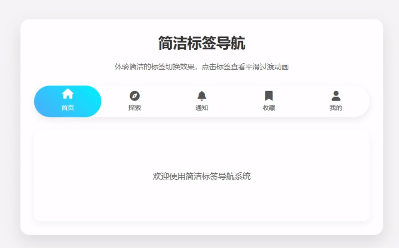
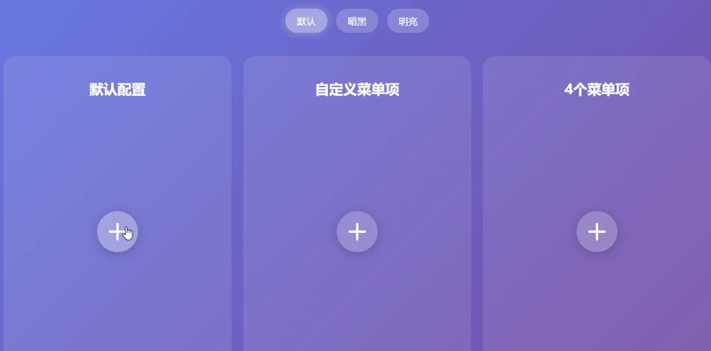
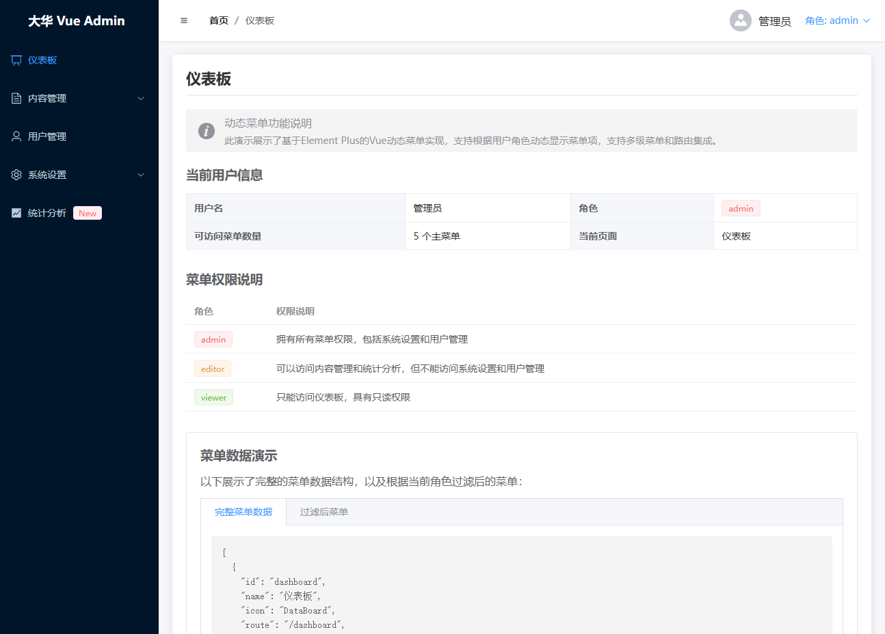

# dh-vue3-component

公众号文章的vue3组件源码

如果觉得好用的话，请给个star和公众号的关注，非常感谢！

****

### 1. input输入框效果（对应文件夹 InputEffect）

公众号文章地址：https://mp.weixin.qq.com/s/0s_MNpFO0_Z8udAyVBIhyA

### 2. vue3+canvas图片添加水印（对应文件夹 CanvasWatermark）

公众号文章地址：https://mp.weixin.qq.com/s/dkpjN40I-nF3GEvF068duA

### 3. vue3全局loading实现（对应文件夹 GlobalLoading）

公众号文章地址：https://mp.weixin.qq.com/s/OMb6P8xPt7b2ULuCUEs_Bg

### 4. Vue3弹性标签导航组件（对应文件夹 ElasticTabs）

公众号文章地址：https://mp.weixin.qq.com/s/fSMv8b_2Z-kozaBeiCgqrA

### 5. Vue3旋转菜单组件（对应文件夹 CircularMenu）

公众号文章地址：https://mp.weixin.qq.com/s/7TvN2XrRa37k-xURN8Nr6A

### 6. js音频可视化效果（对应文件夹 AudioVisualization）

公众号文章地址：https://mp.weixin.qq.com/s/NtQQ6SzxgZw6JcVyMisB4A

### 7. vue3 + Element Plus动态菜单（对应文件夹 DynamicMenu）

